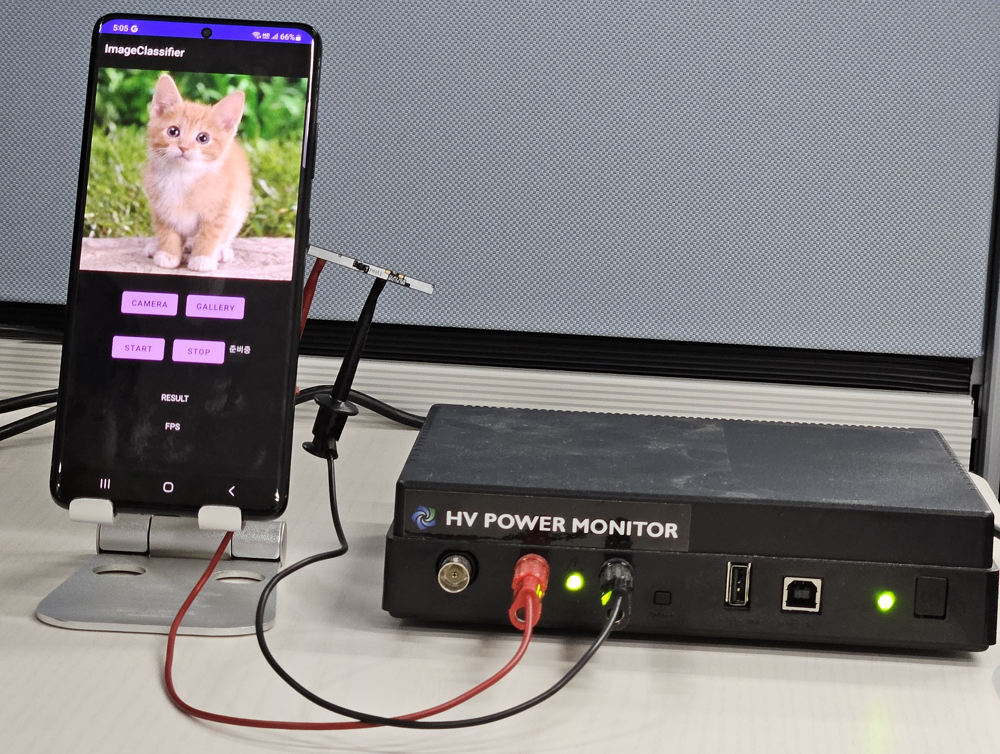
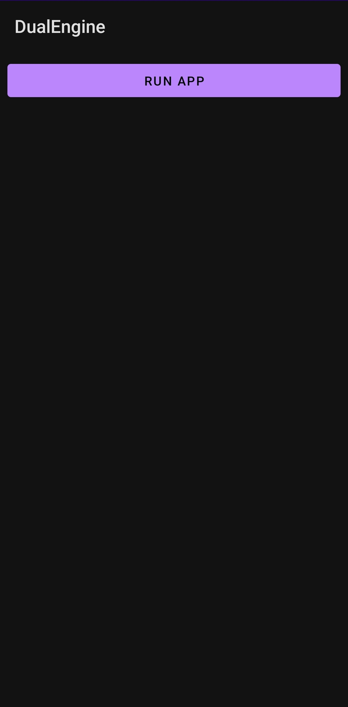
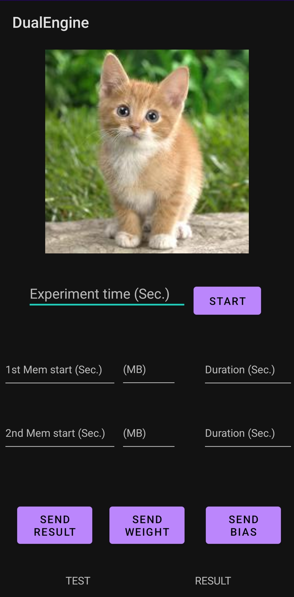

# DualEngine: Thermal-Aware Co-Execution of On-device Processing and MEC Offloading for Mobile Artificial Intelligence

[](https://developer.android.com/)
[](https://kotlinlang.org/)
[](https://www.oracle.com/java/)
[](https://www.python.org/)
[](https://www.tensorflow.org/lite)
[](https://pytorch.org/)

This repository is the official implementation of "DualEngine: Thermal-Aware Co-Execution of On-device Processing and MEC Offloading for Mobile Artificial Intelligence," submitted to MICRO 2025.

##  Abstract

On-device AI enables real-time inference on mobile devices but often suffers from thermal throttling due to CPU/GPU overheating. 
Offloaded AI, which delegates inference tasks to nearby edge servers, has emerged as a promising alternative, yet the thermal impact of the wireless modem is largely overlooked. In this paper, we conduct a thermal analysis of both on-device AI and offloaded AI, revealing that (i) modem heat becomes significant during offloading and is thermally coupled with processor temperature, and (ii) coordinated co-execution of on-device AI and offloaded AI can improve FPS and thermal stability over standalone modes. Based on these insights, we present _DualEngine_, a thermal-aware co-execution framework that dynamically allocates thermal budgets between processors and modem. Leveraging reinforcement learning, _DualEngine_ adjusts the DNN model selection, CPU/GPU clock frequency, and offloading rate to prevent thermal throttling while maximizing inference performance. Implemented on COTS smartphones and an edge server, _DualEngine_ shows up to 12.8 times improvement in thermal constraint compliance and 3.7 times increase in FPS under realistic and dynamic environments.


## Getting Started
_DualEngine_ consists of (1) **Mobile device**, which runs on-device AI (i.e., image classification or pose-estimation) and DRL to decide control variables (e.g., CPU/GPU clock frequencies), and (2) **Server**, which processes offloaded images from the mobile device.

To run the program, we need _both of them_.

## Preparing the server
### Prerequisites
- **python**: 3.11
- **CUDA**: 12.1 
- **torch**: 2.5.1+cu121
- **torchvision**: 0.20.1+cu121
- **torchaudio**: 2.5.1+cu121
1. **Install prerequisites**
   ```bash
   pip install torch torchvision torchaudio --index-url https://download.pytorch.org/whl/cu121
   ```

### Installation
1. **Install requirements**
   ```bash
   pip install -r requirements.txt
   ```

2. **Start server with your IP and port**
   ```bash
   python ./model_test_yolo_socket --ip=000.000.000.000 --port=9999
   ```
    `--ip` is your server’s ip

    `--port` is your server’s port number

    You should see the following sentence.
   ```bash
   waiting connection...
   ```

    You can move on to **Mobile device** now!

## Preparing a Mobile device
- **Android SDK**: API level 32 (Android 12.0), Kernel version 5.4
- **Device Requirements**: 
  - Root access (for CPU/GPU frequency scaling and resource monitoring)

### (Optional) Power logging using Monsoon power monitor
First, you need to remove the phone battery and connect it to Monsoon like the picture below. 



Then, on your desktop, follow the instructions. 
1. **Install Monsoom package**
   ```bash
   pip install Monsoon
   ```


2. **Turn on your phone**
   ```bash
   python ./power_onoff.py
   ```

3. **Now you can log your phone’s power consumption**
   ```bash
   python ./mobile_logger.py --name=S21 --time=300
   ```
    `--name` is the name of the output file (.csv)

    `--time` is the duration of the logging in seconds


### (Optional) Customizing deep learning model for DRL
Our system model could be easily extended to include uncovered features such as energy consumption (unless we cannot measure or control). 

You can customize the number of states, actions, and others on lines 14~18 of `drl-model-maker.py`. 

Then make a .tflite deep learning model which fits our (or customized) state/action space size. 

   ```bash
   python ./drl-model-maker.py
   ```

The output file is `model.tflite`

It should be placed in app/assets/ along with other models.


### Run App on Mobile device
1. **Open `ImageClassifier` folder in Android Studio**
   - Import the project
   - Sync Gradle files

2. **And run!**

    The app will require
   - Grant storage permissions
   - Enable root access for frequency control




Once you push the "Run App" button, it will start to load all DNN models into memory.

It will take a few seconds.

3. **Configuration**

You can decide the 1. duration of the test, 2. (optional) {start time, memory consumption, duration} of 2 CPU/memory load.



After filling in the designated forms, you can start the test by pushing the start button.

Remember, the server should be showing `waiting connection...`

4. **Send result**

Once the mobile device finishes the test, you can send the result (.csv file containing FPS, temperatures, memories, and so on) and the trained DRL file (weight, bias) 


## State / Action / Result

We provide detailed examples of state, action, reward to improve reproducibility and help customization. 

```kotlin
// state = (temperature of {CPU core1, CPU core2, GPU, communication modem} in celcius = [h_CPU0, h_CPU4, h_GPU, h_5G], ...  // ex) [50f, 50f, 52f, 60f]
//          available memory in MB [m_available], ... // ex) [500] 
//          clock frequency levels [cpu0, cpu4, gpu], ... // ex) [0f, 0f, 0f], each corresponds to actual clock freqeuencies. cpu0 0f => cpu0_list[0] = 754000kHz
//          offloading rate and offladed FPS [r, r_sent], ... // ex) [0f, 15f], offloading rate corresponds to predefined offloading rates. r 0f => off_list[0] = 4
//          preloaded DNN models [l1, l2], ... // ex) [0f, 1f] means medium model is not loaded, and large model is loaded
//          current DNN model in use [model], ... // ex) [2f] means large model is used in current time slot
//          FPS processed with on-device AI [FPSlocal], ... /// ex) [10f]
//          average accuracy of current time slot [acc] ex) [77f]
var state = floatArrayOf(h_CPU0, h_CPU4, h_GPU, h_5G, m_available, cpu0, cpu4, gpu, r, r_sent, l1, l2, model, FPSlocal, acc)

// action = Our action space size is currently 81 = CPU clock (3) * GPU clock (3) * offloading rate (3) * model selection (3) 
//          DQN model outputs number between 0~80. We interpret the output in ternary manner. 
//          If output is 0, CPU clock (0), GPU clock (0), offloading rate (0), model selection (0)
//          If output is 3, CPU clock (0), GPU clock (0), offloading rate (1), model selection (0)
//          Each clock / offloading rate / model selection follows its own list. For example CPU clock 0 = cpu0_list[0] = 754000kHz
var action = getAction(state)  // number between 0~80.

// reward = After running action, we calculate reward. 
//          getReward outputs = [Total reward, heat reward, memory reward, FPS reward, accuracy reward, average accuracy]
//          Total reward is for DQN
//          Others are for exploration safety strategy
var reward = getReward(state)  
```

##  Parameter configuration

Below are the parameters we used for the test. 

You can change them in `PhotoActivity.kt`

### DQN Parameters
```kotlin
// Reward weights
val lambda = 100f // Thermal weight
val kappa = 8f    // Memory weight  
val mu = 50f      // FPS weight
val nu = 5f       // Accuracy weight

// Thresholds
val h_th = 80000.0f   // Thermal threshold
val m_th = 500f       // Memory threshold (MB)
val targetFPS = 20f   // FPS threshold

// Epsilon and learning rate
var epsilon = 1f          // Epsilon for epsilon-greedy
var epsilonDecay = 0.95f  // Decay ratio of epsilon
var lr = 0.2f             // learning rate
```

### Tips for configuration
You should be CAREFUL changing parameters. 

There are always trade-offs for each of them. 

For example, high lambda (thermal weight) brings higher thermal stability, but might lower FPS performance. 

The graph below shows some insight for changing parameters. 


##  Acknowledgments
[stress-ng](https://github.com/ColinIanKing/stress-ng) 
[YOLO](https://docs.ultralytics.com/) 
[MobileNet](https://github.com/tensorflow/models/tree/master/research/slim/nets/mobilenet)


